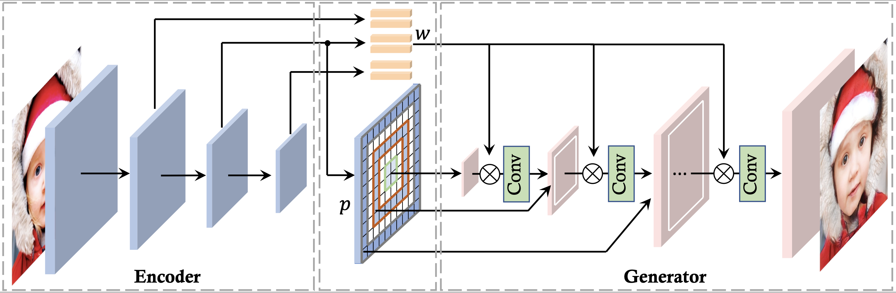
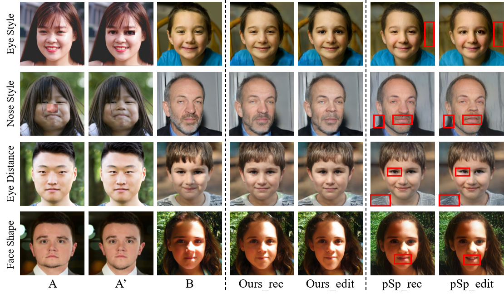

# PadInv - High-fidelity GAN Inversion with Padding Space

> **High-fidelity GAN Inversion with Padding Space** <br>
> Qingyan Bai*, Yinghao Xu*, Jiapeng Zhu, Weihao Xia, Yujiu Yang, Yujun Shen <br>
> *European Conference on Computer Vision (ECCV) 2022*


**Figure:** Our encoder produces instance-aware coefficients to replace the fixed padding used in the generator. Such a design improves GAN inversion with better spatial details.

[[Paper](https://arxiv.org/pdf/2203.11105.pdf)]
[[Project Page](https://ezioby.github.io/padinv/)]

In this work, we propose to involve the **padding space** of the generator to complement the native latent space, facilitating high-fidelity GAN inversion. Concretely, we replace the constant padding (*e.g.*, usually zeros) used in convolution layers with some instance-aware coefficients. In this way, the inductive bias assumed in the pre-trained model can be appropriately adapted to fit each individual image. We demonstrate that such a space extension allows a more flexible image manipulation, such as the **separate control** of face contour and facial details, and enables a **novel editing manner** where users can *customize* their own manipulations highly efficiently.

## Qualitative Results

From top to bottom: (a) high-fidelity GAN inversion with spatial details, (b) face blending with contour from one image and details from another, and (c) customized manipulations *with one image pair*.


Additional inversion results.


Additional face blending results.


Additional customized editing results.



## Preparation
To train or test PadInv, preparing the data and pre-trained GAN checkpoints are needed at first.

For data, please download FFHQ and CelebA-HQ-testset for face domain, 
and LSUN Church and Bedroom for indoor and outdoor scene, respectively.

For pre-trained GAN checkpoints, you can download them here: 
[StyleGAN2-FFHQ](https://drive.google.com/file/d/1cF7oKKVOgMuXpXifSeD8PyaVYTBaOBsf/view?usp=sharing), 
[StyleGAN2-Church](https://drive.google.com/file/d/1Ww9YXlAVuRt0Ign0ulYtsttmX7Mh35wH/view?usp=sharing), 
[StyleGAN2-Bedroom](https://drive.google.com/file/d/1LTEU2Dt2pyJTHHUTjwFWAkmNco3EXmfL/view?usp=sharing).

## Training
#### Training Scripts
Please use the following scripts to train PadInv corresponding to various domains.  
```
# Face
bash scripts/encoder_scipts/encoder_stylegan2_ffhq_train.sh 8 your_training_set_path your_test_set_path your_gan_ckp_path --job_name=your_job_name 
# Church
bash scripts/encoder_scipts/encoder_stylegan2_church_train.sh 8 your_training_set_path your_test_set_path your_gan_ckp_path --job_name=your_job_name 
# Bedroom
bash scripts/encoder_scipts/encoder_stylegan2_bedroom_train.sh 8 your_training_set_path your_test_set_path your_gan_ckp_path --job_name=your_job_name 
```
In scripts above, '8' indicates the gpu amount for training. 
'your_training_set_path' and 'your_test_set_path' indicate the dataset paths 
(e.g. ```data/ffhq.zip, data/CelebA-HQ-test```, or ```data/bedroom_train_lmdb```).
For training and testing on LSUN, we support direct reading the LMDB directory thanks to 
[Hammer](https://github.com/bytedance/Hammer). 
 
'your_gan_ckp_path' indicates the path of the pre-trained GAN checkpoint to be inverted. 
'your_job_name' indicates the name of this training job and the name of the job working directory.

#### Results
1. Testing metric results and visualization results of inversion can be found in ```work_dir/your_job_name/results/```.
2. The training log is saved at ```work_dir/your_job_name/log.txt```.
3. Checkpoints can be found in ```work_dir/your_job_name/checkpoints/```. 
Note that we save the checkpoints corresponding to the best metrics and the latest ones.


## BibTeX

If you find our work or code helpful for your research, please consider to cite:
```bibtex
@article{bai2022high,
  title   = {High-fidelity GAN Inversion with Padding Space},
  author  = {Bai, Qingyan and Xu, Yinghao and Zhu, Jiapeng and Xia, Weihao and Yang, Yujiu and Shen, Yujun},
  journal = {arXiv preprint arXiv:2203.11105},
  year    = {2022}
}
```

## Acknowledgement
Thanks to
[Hammer](https://github.com/bytedance/Hammer),
[StyleGAN2](https://github.com/NVlabs/stylegan2), and
[Pixel2Style2Pixel](https://github.com/eladrich/pixel2style2pixel)
for sharing the code.
